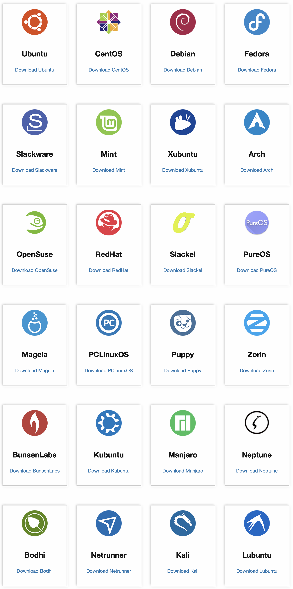

Operation Systems
=================

Popular Operation Systems
-------------------------

- Windows
    Desktop.
- Linux
    Servers.
- MacOS
    Desktop.

Linux Distributions
-------------------

See `Linux official website <https://www.linux.org>`_ for more info.   

A Linux distribution (or distro for short) is a collection of software 
that is built on top of the Linux kernel. It includes the kernel itself, 
as well as a set of libraries and tools that are necessary to run the operating system. 
Linux distributions are typically developed by communities of volunteers, 
and they are released on a regular basis.

There are many different Linux distributions available, 
each with its own unique set of features and goals. 
Some of the most popular distributions include 
Ubuntu, Debian, Red Hat Enterprise Linux (RHEL), CentOS, Fedora, openSUSE, and Arch Linux.

Ubuntu
    A desktop-oriented distribution 
    that is known for its ease of use and wide range of software support. 
Debian
    A stable distribution that is known for its reliability and security. 
RHEL
    An enterprise-oriented distribution that is known for its stability and security. 
CentOS
    A free distribution that is compatible with RHEL. 
Fedora
    A community-driven distribution that is known 
    for its innovation and cutting-edge technologies. 
openSUSE
    A desktop-oriented distribution that is known 
    for its ease of use and wide range of software support. 
Arch Linux
    A rolling release distribution that is known 
    for its flexibility and customization options.

Linux distributions are a great choice for a wide range of users, 
from beginners to experienced system administrators. 
They are free to use and distribute, 
and they offer a wide range of features and customization options.

    

Why `Ubuntu`
------------

Reasons to pick Ubuntu:

- Active community: easy to find solutions when facing problems!
- Package management: `apt`
- Desktop: `GNOME`
- Latest release: 22.04LTS / 23.04

See `Ubuntu official website <https://ubuntu.com/>`_ for more info.
    